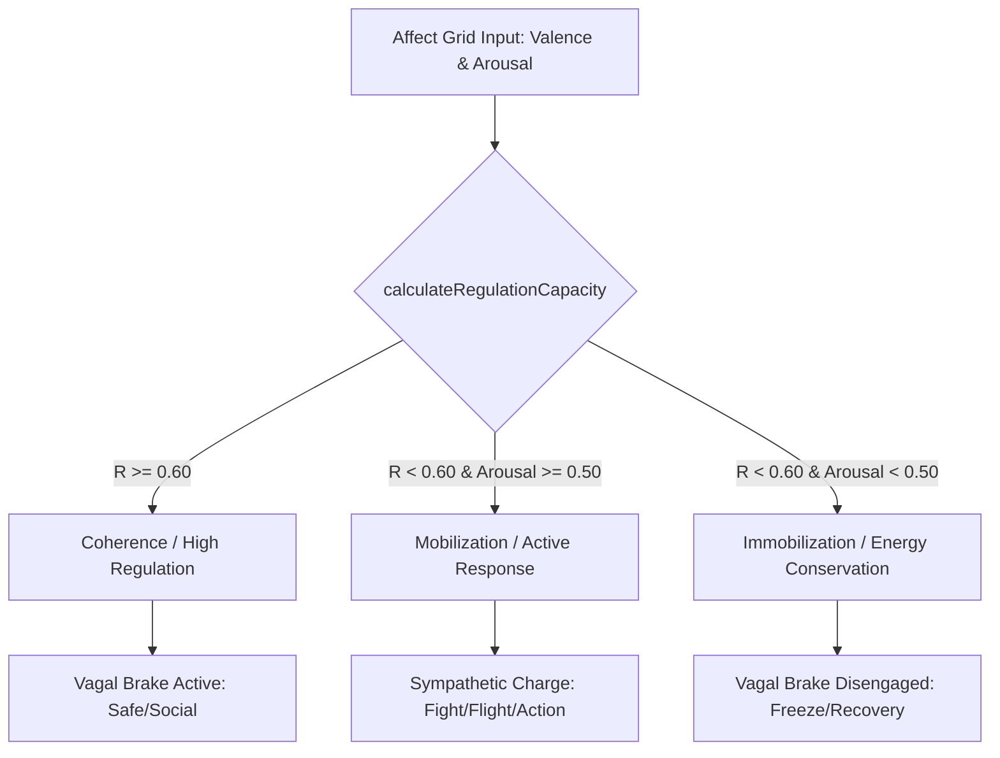

# Scientific Architecture: Neurovisceral Integration Model (NIM) in Aura

This document outlines Aura's transition from Polyvagal Theory (PVT) to Thayer & Lane's **Neurovisceral Integration Model (NIM)**, providing the physiological and neuroscientific basis for our autonomic regulation features.

---

## 1. Context: Why Pivot from Polyvagal Theory?

While Stephen Porges' Polyvagal Theory has been widely adopted in somatic psychotherapy and wellness copy, its neurophysiological and evolutionary assumptions have faced significant scientific criticism:

1. **Weak Evolutionary Proof:** The claim of a phylogenetic "three-stage" progression of the vagus nerve (unmyelinated dorsal, sympathetic, myelinated ventral) is not supported by comparative neuroanatomy.
2. **Anatomical Inconsistencies:** The strict functional division between the dorsal motor nucleus (DMNX) and nucleus ambiguus (NA) is not as distinct or exclusive as the theory requires.
3. **RSA as a Vagal Metric:** Respiratory Sinus Arrhythmia (RSA) is highly variable under different physical workloads and metabolic conditions, making it an unreliable direct proxy for psychological vagal tone.

*Grossman et al. (February 2026, Clinical Neuropsychiatry)* formalized these criticisms, calling the evolutionary and anatomical core of Polyvagal Theory "untenable."

---

## 2. The Alternative: Neurovisceral Integration Model (Thayer & Lane, 2000)

The **Neurovisceral Integration Model (NIM)** frames autonomic regulation as the capacity of the **Prefrontal Cortex (PFC)** to exert top-down, inhibitory control over subcortical threat-detection circuits (such as the amygdala), thereby regulating autonomic responses (heart rate, breathing, visceral responses).

### Key Concepts:
*   **Central Autonomic Network (CAN):** A network of brain structures (including the PFC, anterior cingulate cortex, insula, amygdala, and brainstem nuclei) that coordinate visceromotor, neuroendocrine, and behavioral responses.
*   **Vagal Brake (Top-Down Control):** Prefrontal structures modulate cardiac output via vagal efferent pathways. Active regulation keeps heart rate low and steady, facilitating safe social engagement.
*   **Autonomic Flexibility:** The capacity of the nervous system to adaptively transition between activation (mobilization) and recovery (coherence).
*   **HRV as a Biomarker:** Vagal-mediated Heart Rate Variability (vmHRV) is a direct, validated index of prefrontal-autonomic connectivity and emotional regulation capacity.

---

## 3. Aura's Algorithmic Translation

Aura maps user-reported somatic and emotional states into autonomic zones derived from NIM principles.

### Core Equations:

#### A. Autonomic Regulation Capacity (\(R\))
Instead of discrete steps, we define a continuous regulation index \(R \in [0, 1]\) based on Valence (\(v\)) and Arousal (\(a\)):
\[R = v - 0.4 \times |a - 0.25|\]
*   **Optimal Arousal (\(a = 0.25\)):** The homeostatic baseline representing a calm, alert state.
*   **Arousal Penalty (\(|a - 0.25| \times 0.4\)):** Deviations from optimal arousal reduce the regulation capacity index.

#### B. Continuous Visual Ladder Mapping (\(y\))
Instead of static weights (Ventral = 0.15, Sympathetic = 0.50, Dorsal = 0.85), \(y\) is generated continuously using the implicit regulation index \(R_{\text{implicit}}\):
\[R_{\text{implicit}} = p_{\text{coherence}} \times 0.85 + p_{\text{mobilization}} \times 0.50 + p_{\text{immobilization}} \times 0.15\]
\[y = (1 - R_{\text{implicit}}) \times 100\%\]
This aligns Ventral/Coherence to \(15\%\) height, Sympathetic/Mobilization to \(50\%\), and Dorsal/Immobilization to \(85\%\), while allowing any intermediate state combinations to glide continuously along the vertical axis.

#### C. Autonomic Flexibility (Otonom Esneklik)
Autonomic Flexibility replaces the previous check-in plasticity count. Analyzed across the last 10 entries:
\[\text{Flexibility} = (w_{\text{activity}} \cdot \text{Activity} + w_{\text{var}} \cdot \text{Variance} + w_{\text{rec}} \cdot \text{Recovery}) \times 100\]
*   **Activity:** \(\min(1.0, N / 7)\) (regular check-ins reward up to 7 logs).
*   **Variance:** \(\min(1.0, \text{Var}(R_1, \dots, R_N) \times 8)\) (measures active regulation span).
*   **Recovery:** \(\min(1.0, \text{RecoveryMagnitude} \times 1.5)\) (measures the average positive shifts \(R_{t} - R_{t-1}\) from low-regulation starting states \(R_{t-1} < 0.45\)).
*   **Weights:** \(w_{\text{activity}} = 0.30, w_{\text{var}} = 0.35, w_{\text{rec}} = 0.35\).

